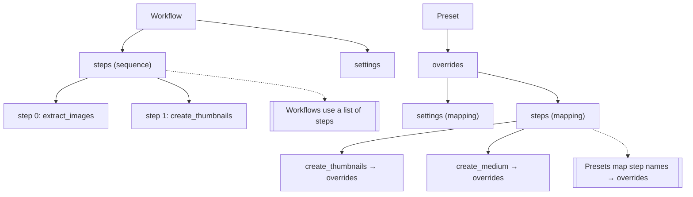

# Presets System Guide

The imgxsh presets system allows you to create reusable workflow configurations with customizable overrides. Presets are based on existing workflows but can modify settings, parameters, and step behavior to create specialized variants.

## Table of Contents

- [Preset Overview](#preset-overview)
- [Preset Structure](#preset-structure)
- [Built-in Presets](#built-in-presets)
- [Creating Custom Presets](#creating-custom-presets)
- [Preset Usage](#preset-usage)
- [Advanced Preset Features](#advanced-preset-features)
- [Examples](#examples)

## Preset Overview

Presets are YAML files that extend or modify existing workflows. They provide:

- **Quick access** to common workflow variations
- **Parameter overrides** for different use cases
- **Step modifications** without duplicating entire workflows
- **User customization** while maintaining base workflow structure

### Preset vs Workflow

- **Workflow**: Complete, self-contained processing pipeline
- **Preset**: Configuration that modifies an existing workflow for specific needs

## Preset Structure

### Basic Preset Structure

```yaml
# Preset metadata
name: preset-name
description: "Human-readable description of what this preset does"
base_workflow: workflow-name  # The workflow this preset extends

# Override settings
overrides:
  settings:
    # Override global settings
    parallel_jobs: 8
    output_dir: "./custom-output"
    
  steps:
    # Override specific step parameters
    step_name:
      params:
        # Override step parameters
        quality: 70
        width: 200
      enabled: true  # Enable/disable steps
```

### DO / DON'T: steps structure in presets

> In presets, `overrides.steps` is a mapping (dictionary) from step-name to its overrides. Do not switch to a YAML sequence under this key.

- DO: use a mapping with named step keys

```yaml
overrides:
  steps:
    create_thumbnails:
      params:
        width: 300
        height: 200
    create_medium:
      params:
        width: 800
        height: 600
```

- DON'T: mix a mapping with a list item under the same key

```yaml
overrides:
  steps:
    create_thumbnails: { params: { width: 300, height: 200 } }
    - name: create_medium   # INVALID: sequence item alongside mapping
      params: { width: 800, height: 600 }
```

Why: YAML requires a single node type for a given key. Our preset system also expects a mapping so it can look up overrides by step name.

### Visual model



### Preset Properties

- **`name`**: Unique identifier for the preset (required)
- **`description`**: Human-readable description of the preset's purpose
- **`base_workflow`**: Name of the workflow this preset extends (required)
- **`overrides`**: Configuration overrides to apply

## Built-in Presets

imgxsh comes with several built-in presets for common use cases.

### Quick Thumbnails Preset

**File**: `config/presets/quick-thumbnails.yaml`

```yaml
name: quick-thumbnails
description: "Generate small PNG thumbnails quickly for preview purposes"
base_workflow: pdf-to-web

# Override settings for speed and smaller size
overrides:
  settings:
    parallel_jobs: 8  # More parallel processing for speed

  steps:
    create_thumbnails:
      params:
```

### Batch Processing Presets

#### High-Performance Batch Preset

**File**: `config/presets/high-performance-batch.yaml`

```yaml
name: high-performance-batch
description: "High-performance batch processing with maximum parallelization"
base_workflow: batch-convert

overrides:
  settings:
    parallel_jobs: 16  # Maximum parallel processing
    max_memory: "4GB"  # High memory allocation
    
  steps:
    convert_format:
      params:
        parallel: true
        max_parallel: 16
        quality: 85
        format: "webp"
```

#### Conservative Batch Preset

**File**: `config/presets/conservative-batch.yaml`

```yaml
name: conservative-batch
description: "Conservative batch processing for resource-limited systems"
base_workflow: batch-convert

overrides:
  settings:
    parallel_jobs: 2  # Limited parallel processing
    max_memory: "1GB"  # Low memory usage
    
  steps:
    convert_format:
      params:
        parallel: true
        max_parallel: 2
        quality: 80
        format: "jpg"
```

#### Web Optimization Batch Preset

**File**: `config/presets/web-optimization-batch.yaml`

```yaml
name: web-optimization-batch
description: "Batch optimize images for web use with multiple sizes"
base_workflow: web-optimize

overrides:
  settings:
    parallel_jobs: 8
    output_dir: "./web-optimized"
    
  steps:
    resize_for_web:
      params:
        max_width: 1200
        max_height: 800
        quality: 85
        format: "webp"
        parallel: true
        max_parallel: 8
```
        width: 150
        height: 100
        # Note: Produces PNG thumbnails with white background

    create_full_size:
      # Skip full-size creation for quick mode
      enabled: false

    generate_gallery_html:
      # Skip gallery generation since no full-size images exist
      enabled: false
```

**Output**: PNG thumbnails only (no gallery.html)

**Use Cases**:
- Quick PDF preview generation
- Batch processing where speed is priority over quality
- Initial content review before full processing

**Note**: This preset does not generate an HTML gallery since full-size images are disabled. Use the standard `pdf-to-web` workflow if you need a gallery.

### Web Optimization Preset

**File**: `config/presets/web-optimization.yaml`

```yaml
name: web-optimization
description: "Optimize images for web with aggressive compression"
base_workflow: pdf-to-web

overrides:
  settings:
    parallel_jobs: 6
    
  steps:
    create_thumbnails:
      params:
        width: 400
        height: 300
        quality: 75
        format: "webp"
        
    create_full_size:
      params:
        format: "webp"
        quality: 80
        max_width: 800
        max_height: 600
```

**Use Cases**:
- Web gallery creation with optimized file sizes
- Mobile-friendly image generation
- Bandwidth-conscious image processing

### High Quality Preset

**File**: `config/presets/high-quality.yaml`

```yaml
name: high-quality
description: "Generate high-quality images for print or archival"
base_workflow: pdf-to-web

overrides:
  settings:
    parallel_jobs: 2  # Fewer parallel jobs for quality
    
  steps:
    create_thumbnails:
      params:
        width: 600
        height: 400
        quality: 95
        format: "png"
        
    create_full_size:
      params:
        format: "tiff"
        quality: 100
        preserve_metadata: true
```

**Use Cases**:
- Print-ready image generation
- Archival quality preservation
- Professional document processing

## Creating Custom Presets

### Step 1: Choose Base Workflow

Select an existing workflow that closely matches your needs:

```bash
# List available workflows
imgxsh --list-workflows

# View workflow details
imgxsh --workflow-info pdf-to-web
```

### Step 2: Create Preset File

Create a new preset file in the presets directory:

```bash
# Create preset directory if it doesn't exist
mkdir -p ~/.imgxsh/presets

# Create your preset file
touch ~/.imgxsh/presets/my-custom-preset.yaml
```

### Step 3: Define Preset Configuration

```yaml
name: my-custom-preset
description: "Custom preset for my specific needs"
base_workflow: pdf-to-web

overrides:
  settings:
    output_dir: "./my-output"
    parallel_jobs: 4
    
  steps:
    create_thumbnails:
      params:
        width: 250
        height: 180
        quality: 85
        
    create_full_size:
      params:
        format: "jpg"
        quality: 90
        max_width: 1000
```

### Step 4: Test Your Preset

```bash
# Test with dry run
imgxsh --preset my-custom-preset --dry-run document.pdf

# Run the preset
imgxsh --preset my-custom-preset document.pdf
```

## Preset Usage

### Command Line Usage

```bash
# Use a built-in preset
imgxsh --preset quick-thumbnails document.pdf

# Use a custom preset
imgxsh --preset my-custom-preset document.pdf

# List available presets
imgxsh --list-presets

# Get preset information
imgxsh --preset-info quick-thumbnails
```

### Programmatic Usage

```bash
# Use preset in scripts
for pdf in *.pdf; do
    imgxsh --preset web-optimization "$pdf"
done

# Combine with other options
imgxsh --preset quick-thumbnails --output ./batch-output *.pdf
```

## Advanced Preset Features

### Conditional Step Overrides

Override steps conditionally based on context:

```yaml
name: adaptive-preset
description: "Adaptive preset that changes based on input"
base_workflow: pdf-to-web

overrides:
  steps:
    create_thumbnails:
      condition: "image_count <= 10"
      params:
        width: 300
        height: 200
        quality: 85
      else:
        width: 200
        height: 150
        quality: 75
```

### Step Addition and Removal

Add new steps or remove existing ones:

```yaml
name: extended-preset
description: "Extended preset with additional steps"
base_workflow: pdf-to-web

overrides:
  steps:
    # Disable existing step
    create_full_size:
      enabled: false
      
    # Add new step
    add_watermark:
      type: watermark
      description: "Add watermark to thumbnails"
      params:
        input_dir: "{temp_dir}/extracted"
        watermark_image: "/path/to/watermark.png"
        position: "bottom-right"
        opacity: 0.5
        output_template: "{output_dir}/watermarked/{counter:03d}.jpg"
```

### Hook Overrides

Override or extend workflow hooks:

```yaml
name: notification-preset
description: "Preset with custom notifications"
base_workflow: pdf-to-web

overrides:
  hooks:
    on_success:
      - echo "Custom preset completed successfully!"
      - notify-send "imgxsh" "Processing complete: {workflow_input}"
      
    on_failure:
      - echo "Custom preset failed!"
      - mail -s "imgxsh Error" admin@example.com < /tmp/imgxsh-error.log
```

### Multiple Base Workflows

Create presets that combine multiple workflows:

```yaml
name: multi-workflow-preset
description: "Preset that combines multiple workflows"
base_workflow: pdf-to-web

overrides:
  # First run pdf-to-web workflow
  steps:
    # ... pdf-to-web steps ...
    
  # Then add excel processing
  additional_workflows:
    - name: excel-extract
      condition: "has_excel_files"
      params:
        input_dir: "{workflow_input}"
        output_dir: "{output_dir}/excel"
```

## Examples

### PDF to Web Gallery Presets

The `pdf-to-web` workflow is perfect for creating presets that customize the gallery generation for different use cases.

#### High-Quality Gallery Preset

Create a high-quality gallery with larger images and better compression:

```yaml
name: high-quality-gallery
description: "High-quality PDF gallery with larger images"
base_workflow: pdf-to-web

overrides:
  settings:
    output_dir: "./high-quality-gallery"
    parallel_jobs: 2  # Reduce parallel jobs for better quality
    
  steps:
    create_thumbnails:
      params:
        width: 400
        height: 300
        quality: 90
        format: "jpg"
        
    create_full_size:
      params:
        format: "webp"
        quality: 95
        max_width: 1920
        max_height: 1080
        
    generate_gallery_html:
      params:
        script: |
          #!/bin/bash
          # Generate high-quality gallery with enhanced styling
          html_file="{output_dir}/gallery.html"
          
          cat > "$html_file" << 'EOF'
          <!DOCTYPE html>
          <html lang="en">
          <head>
              <meta charset="UTF-8">
              <meta name="viewport" content="width=device-width, initial-scale=1.0">
              <title>High-Quality PDF Gallery</title>
              <style>
                  body { font-family: 'Segoe UI', Tahoma, Geneva, Verdana, sans-serif; margin: 0; background: linear-gradient(135deg, #667eea 0%, #764ba2 100%); }
                  .gallery { display: grid; grid-template-columns: repeat(auto-fill, minmax(350px, 1fr)); gap: 25px; padding: 20px; }
                  .gallery-item { background: white; border-radius: 12px; padding: 20px; box-shadow: 0 8px 32px rgba(0,0,0,0.1); transition: transform 0.3s ease; }
                  .gallery-item:hover { transform: translateY(-5px); }
                  .gallery-item img { width: 100%; height: auto; border-radius: 8px; cursor: pointer; }
                  .gallery-item h3 { margin: 15px 0 8px 0; color: #333; font-size: 18px; }
                  .gallery-item p { margin: 0; color: #666; font-size: 14px; }
                  .modal { display: none; position: fixed; z-index: 1000; left: 0; top: 0; width: 100%; height: 100%; background-color: rgba(0,0,0,0.95); }
                  .modal-content { margin: auto; display: block; max-width: 95%; max-height: 95%; }
                  .close { position: absolute; top: 20px; right: 40px; color: #f1f1f1; font-size: 50px; font-weight: bold; cursor: pointer; }
              </style>
          </head>
          <body>
              <h1 style="text-align: center; color: white; margin: 30px 0;">High-Quality PDF Gallery</h1>
              <div class="gallery">
          EOF
          
          # Generate gallery items with enhanced styling
          counter=1
          for thumb in "{output_dir}/thumbnails"/*.jpg; do
              if [[ -f "$thumb" ]]; then
                  thumb_name=$(basename "$thumb")
                  full_name="${thumb_name/_thumb_/_full_}"
                  full_name="${full_name/.jpg/.webp}"
                  echo "                  <div class=\"gallery-item\">" >> "$html_file"
                  echo "                      " >> "$html_file"
                  echo "                      <h3>Page $counter</h3>" >> "$html_file"
                  echo "                      <p>Click to view full resolution</p>" >> "$html_file"
                  echo "                  </div>" >> "$html_file"
                  ((counter++))
              fi
          done
          
          cat >> "$html_file" << 'EOF'
              </div>
              <div id="modal" class="modal">
                  <span class="close" onclick="closeModal()">&times;</span>
                  
              </div>
              <script>
                  function openModal(src) {
                      document.getElementById('modal').style.display = 'block';
                      document.getElementById('modalImg').src = src;
                  }
                  function closeModal() {
                      document.getElementById('modal').style.display = 'none';
                  }
                  window.onclick = function(event) {
                      const modal = document.getElementById('modal');
                      if (event.target == modal) {
                          modal.style.display = 'none';
                      }
                  }
              </script>
          </body>
          </html>
          EOF
          
          echo "High-quality gallery created at $html_file"

hooks:
  on_success:
    - echo "High-quality gallery created successfully"
    - echo "Gallery: {output_dir}/gallery.html"
    - echo "Thumbnails: {output_dir}/thumbnails/"
    - echo "Full images: {output_dir}/full/"
```

#### Mobile-Optimized Gallery Preset

Create a mobile-optimized gallery with smaller file sizes:

```yaml
name: mobile-gallery
description: "Mobile-optimized PDF gallery with smaller file sizes"
base_workflow: pdf-to-web

overrides:
  settings:
    output_dir: "./mobile-gallery"
    parallel_jobs: 6  # More parallel jobs for faster processing
    
  steps:
    create_thumbnails:
      params:
        width: 200
        height: 150
        quality: 75
        format: "jpg"
        
    create_full_size:
      params:
        format: "webp"
        quality: 80
        max_width: 800
        max_height: 600
        
    generate_gallery_html:
      params:
        script: |
          #!/bin/bash
          # Generate mobile-optimized gallery
          html_file="{output_dir}/gallery.html"
          
          cat > "$html_file" << 'EOF'
          <!DOCTYPE html>
          <html lang="en">
          <head>
              <meta charset="UTF-8">
              <meta name="viewport" content="width=device-width, initial-scale=1.0">
              <title>Mobile PDF Gallery</title>
              <style>
                  body { font-family: Arial, sans-serif; margin: 0; padding: 10px; background-color: #f5f5f5; }
                  .gallery { display: grid; grid-template-columns: repeat(auto-fill, minmax(150px, 1fr)); gap: 10px; }
                  .gallery-item { background: white; border-radius: 6px; padding: 10px; box-shadow: 0 2px 8px rgba(0,0,0,0.1); }
                  .gallery-item img { width: 100%; height: auto; border-radius: 4px; cursor: pointer; }
                  .gallery-item h3 { margin: 8px 0 4px 0; color: #333; font-size: 14px; }
                  .gallery-item p { margin: 0; color: #666; font-size: 12px; }
                  .modal { display: none; position: fixed; z-index: 1000; left: 0; top: 0; width: 100%; height: 100%; background-color: rgba(0,0,0,0.9); }
                  .modal-content { margin: auto; display: block; max-width: 95%; max-height: 95%; }
                  .close { position: absolute; top: 15px; right: 25px; color: #f1f1f1; font-size: 30px; font-weight: bold; cursor: pointer; }
              </style>
          </head>
          <body>
              <h1 style="text-align: center; color: #333; margin: 20px 0;">Mobile PDF Gallery</h1>
              <div class="gallery">
          EOF
          
          counter=1
          for thumb in "{output_dir}/thumbnails"/*.jpg; do
              if [[ -f "$thumb" ]]; then
                  thumb_name=$(basename "$thumb")
                  full_name="${thumb_name/_thumb_/_full_}"
                  full_name="${full_name/.jpg/.webp}"
                  echo "                  <div class=\"gallery-item\">" >> "$html_file"
                  echo "                      " >> "$html_file"
                  echo "                      <h3>Page $counter</h3>" >> "$html_file"
                  echo "                      <p>Tap to view</p>" >> "$html_file"
                  echo "                  </div>" >> "$html_file"
                  ((counter++))
              fi
          done
          
          cat >> "$html_file" << 'EOF'
              </div>
              <div id="modal" class="modal">
                  <span class="close" onclick="closeModal()">&times;</span>
                  
              </div>
              <script>
                  function openModal(src) {
                      document.getElementById('modal').style.display = 'block';
                      document.getElementById('modalImg').src = src;
                  }
                  function closeModal() {
                      document.getElementById('modal').style.display = 'none';
                  }
                  window.onclick = function(event) {
                      const modal = document.getElementById('modal');
                      if (event.target == modal) {
                          modal.style.display = 'none';
                      }
                  }
              </script>
          </body>
          </html>
          EOF
          
          echo "Mobile gallery created at $html_file"

hooks:
  on_success:
    - echo "Mobile-optimized gallery created successfully"
    - echo "Gallery: {output_dir}/gallery.html"
    - echo "Optimized for mobile devices with smaller file sizes"
```

### Social Media Preset

Create thumbnails optimized for different social media platforms:

```yaml
name: social-media
description: "Generate images for social media platforms"
base_workflow: pdf-to-web

overrides:
  settings:
    output_dir: "./social-media"
    
  steps:
    # Instagram square format
    create_thumbnails:
      params:
        width: 1080
        height: 1080
        quality: 85
        format: "jpg"
        output_template: "{output_dir}/instagram/{counter:03d}.jpg"
        
    # Twitter header format
    create_twitter_header:
      type: resize
      description: "Create Twitter header format"
      params:
        input_dir: "{temp_dir}/extracted"
        width: 1500
        height: 500
        quality: 85
        format: "jpg"
        output_template: "{output_dir}/twitter/{counter:03d}.jpg"
        
    # Facebook post format
    create_facebook_post:
      type: resize
      description: "Create Facebook post format"
      params:
        input_dir: "{temp_dir}/extracted"
        width: 1200
        height: 630
        quality: 85
        format: "jpg"
        output_template: "{output_dir}/facebook/{counter:03d}.jpg"

hooks:
  on_success:
    - echo "Social media images created:"
    - echo "  Instagram: {output_dir}/instagram/"
    - echo "  Twitter: {output_dir}/twitter/"
    - echo "  Facebook: {output_dir}/facebook/"
```

### Batch Processing Preset

Optimize for processing large batches of files:

```yaml
name: batch-processing
description: "Optimized for large batch processing"
base_workflow: pdf-to-web

overrides:
  settings:
    parallel_jobs: 8
    output_dir: "./batch-output"
    
  steps:
    create_thumbnails:
      params:
        width: 200
        height: 150
        quality: 70
        parallel: true
        max_parallel: 8
        
    create_full_size:
      params:
        format: "webp"
        quality: 75
        parallel: true
        max_parallel: 4

hooks:
  pre_workflow:
    - echo "Starting batch processing: {workflow_input}"
    - echo "Using {parallel_jobs} parallel jobs"
    
  post_step:
    - echo "Step {step_name} completed: {processed_count} files processed"
    
  on_success:
    - echo "Batch processing completed: {processed_count} files"
    - echo "Output directory: {output_dir}"
```

### Quality Control Preset

Add quality control and validation steps:

```yaml
name: quality-control
description: "Preset with quality control and validation"
base_workflow: pdf-to-web

overrides:
  steps:
    # Add quality check step
    quality_check:
      type: custom
      description: "Check image quality and dimensions"
      params:
        script: |
          #!/bin/bash
          echo "Checking image quality..."
          for img in {temp_dir}/extracted/*; do
            if [ -f "$img" ]; then
              # Check file size
              size=$(stat -f%z "$img" 2>/dev/null || stat -c%s "$img" 2>/dev/null)
              if [ "$size" -lt 10000 ]; then
                echo "WARNING: $img is too small ($size bytes)"
              fi
              
              # Check dimensions
              dimensions=$(identify -format "%wx%h" "$img" 2>/dev/null)
              echo "Image $img: $dimensions"
            fi
          done
          
    # Modify existing steps
    create_thumbnails:
      params:
        width: 300
        height: 200
        quality: 85
        min_quality: 70  # Ensure minimum quality
        
    create_full_size:
      params:
        format: "webp"
        quality: 90
        max_file_size: "2MB"  # Limit file size

hooks:
  on_failure:
    - echo "Quality control failed - check logs for details"
    - echo "Failed step: {failed_step}"
```

## Best Practices

### Preset Design

1. **Single Purpose**: Each preset should have a clear, single purpose
2. **Descriptive Names**: Use clear, descriptive names that indicate the preset's use case
3. **Documentation**: Always include descriptions explaining when to use the preset
4. **Minimal Overrides**: Only override what's necessary to avoid complexity

### Performance Considerations

1. **Parallel Processing**: Adjust parallel_jobs based on your system capabilities
2. **Quality vs Speed**: Balance quality settings with processing speed
3. **Memory Usage**: Consider memory usage for large batch operations
4. **Disk Space**: Monitor output directory sizes for large batches

### Maintenance

1. **Version Control**: Keep preset files in version control
2. **Testing**: Test presets with various input types
3. **Documentation**: Keep preset documentation up to date
4. **Sharing**: Share useful presets with your team

### Error Handling

1. **Validation**: Validate preset configurations before use
2. **Fallbacks**: Provide fallback options for failed operations
3. **Logging**: Enable appropriate logging levels for debugging
4. **Cleanup**: Ensure proper cleanup of temporary files

## Troubleshooting

### Common Issues

1. **Preset Not Found**: Ensure the preset file is in the correct directory
2. **Base Workflow Missing**: Verify the base workflow exists and is accessible
3. **Invalid Overrides**: Check that override parameters match the base workflow
4. **Permission Issues**: Ensure proper file permissions for preset files

### Debug Mode

Enable debug mode to troubleshoot preset issues:

```bash
# Run preset with debug output
imgxsh --preset my-preset --verbose --dry-run input.pdf

# Check preset configuration
imgxsh --preset-info my-preset --verbose
```

### Validation

Validate preset configurations:

```bash
# Validate preset syntax
imgxsh --validate-preset my-preset.yaml

# Test preset with sample data
imgxsh --preset my-preset --test-mode sample.pdf
```

## Preset Management

### Organizing Presets

```
~/.imgxsh/presets/
├── built-in/           # Built-in presets (read-only)
├── custom/            # User-created presets
├── shared/            # Team-shared presets
└── templates/         # Preset templates
```

### Preset Sharing

```bash
# Export preset for sharing
imgxsh --export-preset my-preset > my-preset.yaml

# Import shared preset
imgxsh --import-preset my-preset.yaml

# Share preset with team
git add ~/.imgxsh/presets/custom/my-preset.yaml
git commit -m "Add custom preset for social media processing"
git push
```

This comprehensive presets system allows you to create reusable, customizable workflow configurations that can be easily shared and maintained across different use cases and teams.
